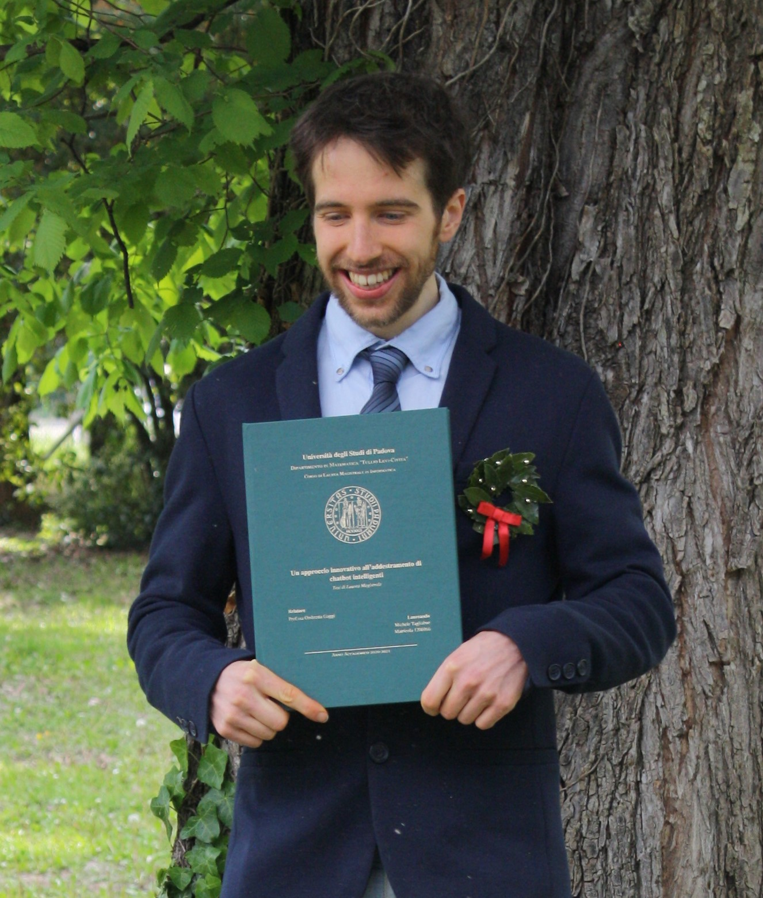

# Michele Tagliabue

MsC Computer Science, Full Stack Developer, interested in AI and ML .

    <i class="fas fa-phone-square"></i> <a href="tel:+393472586417">+393472586417</a> &nbsp; &nbsp;| 
    <i class="fas fa-envelope-open"></i> <a href="mailto:mikitg.michele@gmail.com">mikitg.michele@gmail.com</a> 
    <i class="fab fa-linkedin"></i> <a href="https://www.linkedin.com/in/michele-tagliabue-519482110">My Linkedin Page</a> | <i class="fab fa-github-square"></i> <a href="https://github.com/sommoMicc">My GitHub</a> 
    <i class="fas fa-map-marked"></i> Via Marco Lando 6, 35133 Padova (PD) Italy 
    Nationality: Italian 
    Driving License: B2

## About me

I like to call myself a **geek**.

Regarding information technology <i class="fas fa-tv"></i>, I love to try always new things.

I am passionate about web and mobile development, but recently I have also approached the field of artificial intelligence / machine learning.

As a freelance developer I created a few Android and Flutter <i class="fas fa-mobile-alt"></i> apps, even just to try some new technologies.

I have the passion for device modding: I constantly change ROMs on the phone and system operating on the computer. Some of my projects (including drafts) are available on my [GitHub](https://github.com/sommoMicc).

I like to practice outdoor sports like cycling <i class="fas fa-biking"></i>, running <i class="fas fa-running"></i> and kayaking to keep myself fit and healthy.

## Currently

Working as Fullstack Developer @ Infinitas Learning Ltd.

### Specialized in

Full Stack development, JavaScript/TypeScript focused on:

- Node.js as main backend tool
- React.js, React Native as frontend stack

### Interests

Web and mobile development, algorithms, AI/ML and, most importantly, learning something new everyday!

## Experience

`May 2024 - current`
**Fullstack Developer** @ _Infinitas Learning Ltd._

Infinitas Learning is a group of publishers that operates in the education market in various countries in Europe (like the Netherlands, Belgium, Sweden, Portugal, Poland). 

I am part of ILPT, Infinitas Learning Product and Technology, a remote-first company which builds digital tools for teachers, learners and publishers. I mainly use React and Node, but I did a side project with Rust also.

Working in a collaborative environment with multiple cross-functional teams including designers, product managers, business representatives and other developers.

My key contributions were mainly in improving the ebook-reader functionality of their platform, including optimizing it for touchscreens and mobile devices, enhancing the in-class teaching experience on Interactive Whiteboards. 

\
`June 2021 - May 2024`
**Software Developer** @ _UNOX s.p.a._

UNOX is a company that specializes in the production of professional ovens. The company is a leader in the industry and offers a wide range of ovens for restaurants, gastronomy, pastry shops, bars and cafes, fast food, cooking centers and supermarkets.

The company is AWS patner, and I'm part of the Digital Experience team in charge to develop and mantain all the applications and website of UNOX ecosystem.

A typical day invoves the use of:

- React and React Native, with TypeScript
- Next.js, with all possible optimizations (such as SSR)
- Node.js + Express
- AWS services like S3, DynamoDB, Lambda
- RDBMS such as Postgres, with an eye on query performance optimization
- APM and monitoring tools like AWS CloudWatch and Sentry

As developer, I always have to work together with UI/UX designer using Figma. Also, due to the nature of the job, I often have to get in touch with customers and stakeholders in order to collect feedbacks and ideas from them.

\
`January 2021 - June 2021`
**Java and AI developer** @ _Ifin Sistemi s.r.l._

My tasks right were:

- To develop tests for a Java EE8 application written with Vaadin;
- To develop, improve and integrate an OCR document recognizer.

\
`March 2015 - December 2020`
**Freelance Full Stack Developer**

Worked on various projects including web applications, mobile apps, AI/ML solutions, and digital platforms. Key technologies used: PHP, JavaScript, Node.js, Angular, React, Java, Python, MySQL, MongoDB, AWS services. Gained experience in client interaction, database optimization, OCR systems, chatbot development, and genetic algorithms for scheduling problems.

## Education

`September 2018- April 2021`
**MsC in Computer Science @ University of Padua**

Final score: 108/110.

Thesis: _"An Innovative Approach to NLP Chatbot Training"_ (wrote in Italian). I'm specialized in Internet Technologies and Artificial Intelligence, and I've attended the following courses:

- Computability
- Advanced Algorithms
- Real Time Systems
- Web Information Management
- Wireless Networks
- Mobile programming and Multimedia
- Economics of innovation
- Machine Learning
- Data Mining
- Big Data Computing
- Deep Learning
- Process Mining

The PDF version of my thesis is available [here](media/Tesi_Magistrale_con_ringraziamenti.pdf).

\
**Additional courses**

`February 2021`
['Practical Java Unit Testing with JUnit 5' @ Udemy.com](https://www.udemy.com/course/junit5-for-beginners/)

`February 2021`
['Java Enterprise Edition For Beginners' @ Udemy.com](https://www.udemy.com/course/java-enterprise-edition-8/)

`May 2020`
['The Complete 2021 Flutter Bootcamp with Dart' @ appbrewery.com](https://www.appbrewery.co/courses/548873/)

\
`September 2015 - September 2018`
**BsC in Computer Science @ University of Padua**

Final score: 99/110.

Thesis: "Analysis, improvement and extension of the functionalities of a cruise Booking Engine"

The PDF version of my thesis is available [here](media/tesi.pdf).

## Side projects

- [_FoglioOre_](https://github.com/sommoMicc/FoglioOre), a simple mobile application written entirely in Flutter to generate a monthly time sheet for my mother;
- [_sweet-alert-dialog fork_](https://github.com/sommoMicc/sweet-alert-dialog), a fork of the popular _Sweet Alert Dialog_ implementation for Android (written in Java)
- _MyMemory 2.0_, a multiplayer mobile game inspired by _Ravensburger memory_, written in [Flutter](https://github.com/sommoMicc/MyMemory2.0-Flutter) and [Node.js](https://github.com/sommoMicc/MyMemory2.0-Node)
- [_Deep Learning Homeworks_](https://github.com/sommoMicc/DeepLearning-Homeworks), homework for the _Deep Learning_ university course, built with Python and Tensorflow

<!-- ### Footer

Last updated: May 2013 -->
