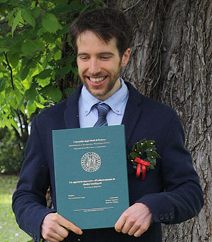

# Michele Tagliabue

MsC Computer Science, Full Stack Developer, interested in AI and ML .

    <i class="fas fa-phone-square"></i> <a href="tel:+393472586417">+393472586417</a> &nbsp; &nbsp;| 
    <i class="fas fa-envelope-open"></i> <a href="mailto:mikitg.michele@gmail.com">mikitg.michele@gmail.com</a> 
    <i class="fab fa-linkedin"></i> <a href="https://www.linkedin.com/in/michele-tagliabue-519482110">My Linkedin Page</a> | <i class="fab fa-github-square"></i> <a href="https://github.com/sommoMicc">My GitHub</a> 
    <i class="fas fa-map-marked"></i> Via Marco Lando 6, 35133 Padova (PD) Italy 
    Nationality: Italian 
    Driving License: B2

## About me

I like to call myself a **geek**.

Regarding information technology <i class="fas fa-tv"></i>, I love to try always new things.

I am passionate about web and mobile development, but recently I have also approached the field of artificial intelligence / machine learning.

As a freelance developer I created a few Android and Flutter <i class="fas fa-mobile-alt"></i> apps, even just to try some new technologies.

I have the passion for device modding: I constantly change ROMs on the phone and system operating on the computer. Some of my projects (including drafts) are available on my [GitHub](https://github.com/sommoMicc).

I like to practice outdoor sports like cycling <i class="fas fa-biking"></i>, running <i class="fas fa-running"></i> and kayaking to keep myself fit and healthy.

## Currently

Working as Full Stack Web Developer @ UNOX s.p.a.

### Specialized in

Full Stack development, JavaScript/TypeScript focused:

- Node.js as main backend tool
- React.js, React Native as frontend stack
- AWS services like Lambda, S3, Lex, DynamoDB

Others:

- A little bit of Flutter and Java for Android development
- Angular and JQuery for web development
- Python with keras/tensorflow for ML
- MySQL/MariaDB, MongoDB as DBMS

### Interests

Web and mobile development, algorithms, AI/ML and, most importantly, learning something new everyday!

## Experience

`June 2021 - current`
**Software Developer** @ _UNOX s.p.a._

UNOX is a company that specializes in the production of professional ovens. The company is a leader in the industry and offers a wide range of ovens for restaurants, gastronomy, pastry shops, bars and cafes, fast food, cooking centers, gastronomy, and supermarkets.

The company is AWS patner, and I'm part of the Digital Experience team in charge to develop and mantain all the applications and website of UNOX ecosystem.

A typical day invoves the use of:

- React and React Native, with TypeScript
- Next.js, with all possible optimizations (such as SSR)
- Node.js + Express
- AWS services like S3, DynamoDB, Lambda
- RDBMS such as Postgres, with an eye on query performance optimization
- APM and monitoring tools like AWS CloudWatch and Sentry

As developer, I always have to work together with UI/UX designer using Figma. Also, due to the nature of the job, I often have to get in touch with customers and stakeholders in order to collect feedbacks and ideas from them.

\
`January 2021 - June 2021`
**Java and AI developer** @ _Ifin Sistemi s.r.l._

My tasks right were:

- To develop tests for a Java EE8 application written with Vaadin;
- To develop, improve and integrate an OCR document recognizer.

\
`September 2020 - December 2020`
**Full stack developer** @ _Primo Round s.r.l._

Here I worked on my master thesis "An Innovative Approach to NLP Chatbot Training".
I developed a web application with Angular, Node.js (NestJS) and MongoDB that helps in generating and deploying a chatbot on the Amazon Lex platform.

The following technologies were involved:

- Angular 10 as Frontend SPA framework;
- Node.js (w/TypeScript) with NestJS as Backend framework;
- MongoDB as DBMS;

During this experience I had the opportunity to try NestJS and, more importantly, to understand how a chatbots and serverless services (like AWS Lambda) work.

\
`March 2015 - September 2020`
**Full Stack Developer** @ _Onda Selvaggia di Sonia Scaioli_

Developing of a digital registration platform fo Onda Selvaggia, available at [iscrizione.ondaselvaggia.com](https://iscrizione.ondaselvaggia.com).

Features:

- Customer management;
- Appointment/calendar management;
- Tracking of hours worked by employees;
- Android application that allows customers to register directly from the secreteriat;
- Collection of clients feedback through self-generated satisfaction questionnaire.

Technologies invoved:

- Frontend: HTML5/CSS3 (boostrap 3)/Javascript (jQuery);
- Backend: PHP/Java/NodeJS/MySQL

\
`July 2015 - October 2020`
**Web Developer and Webmaster** @ _Rossipiero.com_

Designing and development of website [rossipiero.com](http://www.rossipiero.com) using PHP+MySQL+jQuery+Bootstrap.
Designing and development of a CRM for contacts and invoice managment using the same technologies

\
`January 2018 - August 2020`
**Instant Developer programmer and Artificial Intelligence Researcher** @ _Tepui s.r.l._

One of my task was to develop applications using the Instant Developer platform, which involved using also Microsoft SQL Server and Microsoft IIS. I was also assigned with the responsability of interact with a customer.

Another task I had to do was studying and developing a scheduler (using Python) that helped in the process of allocating jobs to mechanics. The problem was essentially an instance of _FJSP_ (_Flexible Job-Shop Problem_) and was solved with a genetic algorithm.

Skills acquired:

- Interaction with customers;
- Understanding of how genetic algorithms work;
- Understanding of FJSP scheduling problem.

\
`June 2018 - October 2018`
**Full stack developer** @ _WebPD s.r.l._

I worked on my BsC thesis "Analysis, improvement and extension of the functionalities of a cruise Booking Engine", whose subject was the website [crociereregalo.it](https://www.crociereregalo.it).

First of all, I had to optimize the execution time of some queries on a Microsoft SQL Server database using SQL Server profiling tools.
Moreover, I had to integrate to an existing cruise booking engine three new webservices of cruise companies (Royal Caribbean, Celebrity, Azamara).
In the end I also tweaked a bit the UI of the website using CSS3 and Boostrap.

Tecnologies involved:

- PHP with CodeIgniter;
- HTML5/CSS3/jQuery + Boostrap;
- Microsoft SQL Server.

## Education

`September 2018- April 2021`
**MsC in Computer Science @ University of Padua**

Final score: 108/110.

Thesis: _"An Innovative Approach to NLP Chatbot Training"_ (wrote in Italian). I'm specialized in Internet Technologies and Artificial Intelligence, and I've attended the following courses:

- Computability
- Advanced Algorithms
- Real Time Systems
- Web Information Management
- Wireless Networks
- Mobile programming and Multimedia
- Economics of innovation
- Machine Learning
- Data Mining
- Big Data Computing
- Deep Learning
- Process Mining

The PDF version of my thesis is available [here](media/Tesi_Magistrale_con_ringraziamenti.pdf).

\
**Additional courses**

`February 2021`
['Practical Java Unit Testing with JUnit 5' @ Udemy.com](https://www.udemy.com/course/junit5-for-beginners/)

`February 2021`
['Java Enterprise Edition For Beginners' @ Udemy.com](https://www.udemy.com/course/java-enterprise-edition-8/)

`May 2020`
['The Complete 2021 Flutter Bootcamp with Dart' @ appbrewery.com](https://www.appbrewery.co/courses/548873/)

\
`September 2015 - September 2018`
**BsC in Computer Science @ University of Padua**

Final score: 99/110.

Thesis: "Analysis, improvement and extension of the functionalities of a cruise Booking Engine"

The PDF version of my thesis is available [here](media/tesi.pdf).

## Side projects

- [_FoglioOre_](https://github.com/sommoMicc/FoglioOre), a simple mobile application written entirely in Flutter to generate a monthly time sheet for my mother;
- [_sweet-alert-dialog fork_](https://github.com/sommoMicc/sweet-alert-dialog), a fork of the popular _Sweet Alert Dialog_ implementation for Android (written in Java)
- _MyMemory 2.0_, a multiplayer mobile game inspired by _Ravensburger memory_, written in [Flutter](https://github.com/sommoMicc/MyMemory2.0-Flutter) and [Node.js](https://github.com/sommoMicc/MyMemory2.0-Node)
- [_Deep Learning Homeworks_](https://github.com/sommoMicc/DeepLearning-Homeworks), homework for the _Deep Learning_ university course, built with Python and Tensorflow

<!-- ### Footer

Last updated: May 2013 -->
